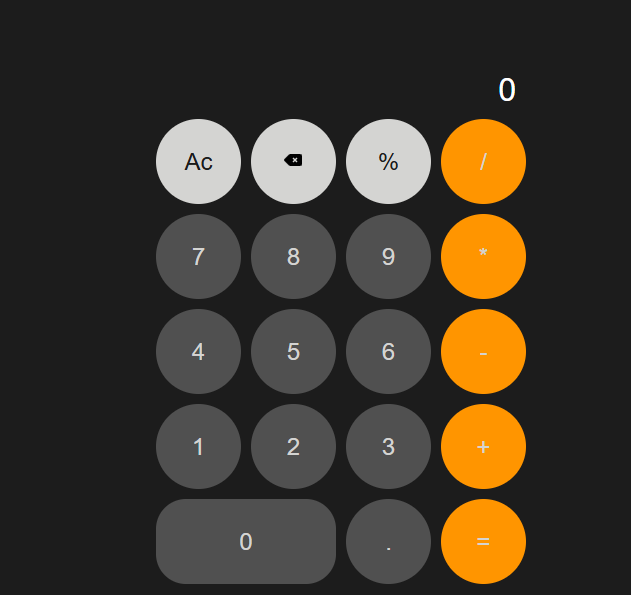

# Calculator App

A modern, responsive calculator built with HTML, CSS & JavaScript, designed to feel like a real-world calculator. Supports basic arithmetic, decimals, percentages and large-number formatting with commas.

---

## 🚀 Features

* ✅ Fully responsive layout for desktop, tablet & mobile.
* Real-time comma formatting while typing numbers.
* Large numbers display in scientific notation (e.g., 1.23e+12).
* Supports keyboard input for all numbers and operators.
* Clear (AC), delete (←), decimal, and percent functionality.
* Smooth hover and click effects on buttons.

---

## 🛠️ Built With

* HTML – structure of the calculator.
* CSS – responsive layout, hover effects and styling.
* JavaScript (Vanilla JS) – calculation logic and dynamic formatting.

---

## 📸 Preview

---

## 🔗 Live Demo

 [Click here to view the app]( https://ceecee-ferdy.github.io/calculator-app/)

---

## 📂 How to Use

1. Open `index.html` in your browser
2. Click or type numbers and operators
3. Press = or Enter to calculate
4. Use Ac to clear all, ← to delete last digit.

